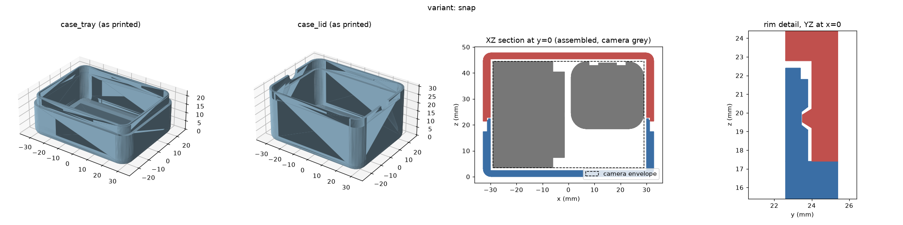

# OBSBOT Tiny 3 Lite carry case

A 3D-printable two-part carry case for the **OBSBOT Tiny 3 Lite** webcam — there was
none. The camera lies flat in a shallow tray under a deep lid, so you pick it up by
the body and never by the gimbal head. Four closure variants (friction, snap detent,
two magnetic), everything generated from one parametric Python script, built
entirely inside Docker.

**Browse the interactive 3D previews and download STLs at
[ardakilic.github.io/obsbot-tiny3-lite-case](https://ardakilic.github.io/obsbot-tiny3-lite-case/).**


*Snap variant — tray and lid as printed, assembled section with the (approximate)
camera model, and the rim detail showing the detent seated in the tongue.*

## The four variants

| | Friction fit — [`friction/`](friction/) | Snap detent — [`snap/`](snap/) | Magnetic — [`magnet/`](magnet/) | Magnetic ×4 — [`magnet4/`](magnet4/) |
|---|---|---|---|---|
| Closure | Slip-fit tongue and groove, 0.2 mm clearance | Same tongue and groove plus a 20 mm ridge inside each long lid wall that clicks into a recess in the tongue | Glide-fit tongue and groove (0.35 mm), held by 2 magnet pairs in lobes mid-way along the long walls | Same, 4 pairs at ±15 mm |
| Stays closed in a bag? | Not guaranteed — friction only | Yes — the lid wall must flex over the detent | Yes — ≈ 12–15 N to pull straight off | Yes — ≈ 25–30 N; peel one end first |
| Hardware | none | none | 4 × Ø6 × 3 mm disc magnets, glue | 8 × Ø6 × 3 mm disc magnets, glue |
| Walls / tongue | 2.4 / 1.0 mm | 2.8 / 1.2 mm (room for the recess) | 2.4 / 1.0 mm + lobes | 2.4 / 1.0 mm + lobes |
| Outer size | 64.8 × 50.0 × 47.8 mm | 65.6 × 50.8 × 47.8 mm | 64.8 × 65.9 × 47.8 mm | 64.8 × 65.9 × 47.8 mm |
| Filament (PETG) | ≈ 44 g | ≈ 50 g | ≈ 53 g | ≈ 62 g |
| Preview | [friction](https://ardakilic.github.io/obsbot-tiny3-lite-case/friction/preview.html) | [snap](https://ardakilic.github.io/obsbot-tiny3-lite-case/snap/preview.html) | [magnet](https://ardakilic.github.io/obsbot-tiny3-lite-case/magnet/preview.html) | [magnet4](https://ardakilic.github.io/obsbot-tiny3-lite-case/magnet4/preview.html) |

The magnetic variants follow the magnet-skirt design of [filtarr](https://github.com/Ardakilic/filtarr):
blind pockets Ø6.4 × 3.2 mm for Ø6 × 3 mm discs, so each magnet sits 0.2 mm recessed and
facing pairs never touch (a controlled snap instead of a hard clack). The pockets open
toward the print top on both parts, so no bridging. Filtarr's flat-lid and pedestal
designs don't transfer: they need a deep tray, which is exactly what makes a camera
hard to grab, so this case keeps its shallow tray and puts the magnets at the split.

Each folder holds `tiny3lite_case_tray.stl`, `tiny3lite_case_lid.stl`, a render sheet
`preview.png`, the interactive `preview.html`, and `tiny3lite_camera.stl` — an
approximate camera model used only for visualisation and the fit checks (don't print it).

## How it is designed

- **Camera lying flat, lens up.** The cavity is 60 × 45.2 × 43 mm: the 60 × 45.2
  pocket is taken from the community
  [Gridfinity organizer](https://www.printables.com/model/1620707-obsbot-tiny-3-lite-webcam-gridfinity-organizer)
  for this camera, whose author test-fitted a real unit (1 mm clearance per end,
  2.1 mm per side); 1 mm above and below the camera's 41 mm.
- **Shallow tray, deep lid.** The tray holds only the bottom 15 mm of the camera;
  26 mm of the body stands proud when the lid is off, so it lifts out by the base.
  No finger scoops are needed, so the closed case has no holes. The weight rests on
  the base; the gimbal head floats with clearance.
- **Tongue and groove** with a lead-in on the tongue tip, two thumb notches on the
  lid's end faces, two crush ribs under the camera base against rattle, rounded
  edges and corners all round.
- **Snap detent** (snap variant): a trapezoidal ridge on the lid's groove wall with
  ~45° ramps both ways, seated in a matching recess in the tongue; the full-thickness
  tongue band above the recess retains the lid.
- **Magnet lobes** (magnet variants): the walls are too thin for a 6.4 mm pocket, so
  each magnet pair lives in a full-height 10 mm lobe on the outside of the long wall,
  blended into the wall with 5 mm fillets (a morphological closing of the outline,
  like filtarr). Pocket centres are 0.8 mm of skin outside the lid's groove wall.
- The outer shell is the plan outline with every edge rounded by 3 mm (a Minkowski
  sum with a sphere), so lobes and corners get the same soft edges.
- Both parts print open side up with no supports.

## Printing

0.2 mm layers, 3 or more perimeters, ~15 % infill, PETG (preferred, the snap flexes
better) or PLA, no supports, both parts as exported (open side up, flat on the bed).

Drop the camera in with the base toward the ribs (the −x end in the viewer), lens
up. Fit tuning after a test print — change parameters, never the geometry:

| Symptom | Fix |
|---|---|
| Lid too tight / too loose (friction) | `make VARIANTS=friction FIT=0.25` / `FIT=0.15` |
| Snap too hard to close | lower in 0.05 steps: `make VARIANTS=snap SNAP=0.25`, or shorten `SNAP_L` |
| Snap pops open | raise `SNAP` |
| Camera rattles / binds | `CLEAR_W` or `RIB` |
| Magnets won't go in / sit proud | `POCKET_D=6.5` / `POCKET_DEPTH=3.4` |

### Magnets (magnet and magnet4)

Ø6 × 3 mm neodymium discs (N35 is plenty). Get the polarity right on the first try:

1. Glue the tray-side magnets into the **tray** pockets (a drop of superglue or epoxy
   per pocket, press flush). Orientation doesn't matter yet.
2. Once cured, drop the remaining magnets **onto the glued ones**; they snap on in the
   correct orientation by themselves.
3. Put a drop of glue in each **lid** pocket, align the lid and press it fully closed.
   The loose magnets seat into the lid pockets with the right polarity. Let it cure
   closed. Gel superglue or 5-minute epoxy is cleaner than thin superglue, whose fumes
   can leave a white residue.

## Building it yourself

Requires only Docker and `make`; nothing is installed on the host.

```sh
make                          # STLs + geometry checks + previews + index.html, all four variants
make stl                      # <variant>/tiny3lite_case_tray.stl, _case_lid.stl, _camera.stl
make check                    # self-checks: watertight, fit, no interference, detent engages
make preview                  # <variant>/preview.png + preview.html
make VARIANTS=snap SNAP=0.25  # one variant with overrides (any parameter below)
make clean
open snap/preview.html        # viewer: Tray / Lid / Camera / X-ray / Cut toggles, Explode slider,
                              # "As printed" layout; needs internet for the three.js CDN
```

`make check` builds every part in memory and asserts: watertight meshes, tray and lid
do not interfere when closed, a sharp 58 × 41 × 41 block *and* the camera model clear
the tray (ribs included) and the lid, assembled size equals the spec, the tongue sits
fully inside the groove, and — the closure test — lifting the lid 1 mm interferes by
≈7 mm³ on the snap variant and by exactly nothing on the others. Magnet variants also
prove every pocket is blind, coaxial across the split and surrounded by at least
0.8 mm of material, and that the magnets sit recessed.

### Parameters (mm, environment variables)

| Name | Default | Meaning |
|---|---|---|
| CAM_W, CAM_D, CAM_H | 41, 41, 58 | Camera bounding box, standing (width, depth, height) |
| CLEAR_L | 1.0 | Clearance per end along the camera's 58 mm length (cavity 60) |
| CLEAR_W | 2.1 | Clearance per side across the 41 mm width (cavity 45.2) |
| CLEAR_H | 1.0 | Clearance above and below the lying camera (cavity 43 tall) |
| WALL | 2.4 (snap 2.8) | Side wall thickness |
| FLOOR | 2.4 | Floor of the tray / ceiling of the lid |
| R_IN | 4 | Cavity vertical corner radius; outer radius = R_IN + WALL |
| R_EDGE | 3 | Rounding of the outer top and bottom edges |
| TRAY | 15 | Cavity height held by the tray; the lid holds the rest |
| LIP_H, LIP_T | 5, 1.0 (snap 1.2) | Tongue height and thickness (0.6 mm lead-in at the tip) |
| FIT | 0.2 (magnet 0.35) | Radial clearance between tongue and groove |
| NOTCH_R | 4 | Thumb notch radius on the lid's end faces |
| RIB | 0.6 | Height of the two anti-rattle ribs (0 disables) |
| SNAP | 0 (snap 0.3) | Detent interference depth; 0 = no detent |
| SNAP_L | 20 | Detent length along each long wall |
| MAG | 0 (magnet 2, magnet4 4) | Magnet pairs: 2 = one per long wall at x = 0, 4 = two per wall at ±15 |
| MAG_D, MAG_T | 6, 3 | Magnet disc diameter and thickness |
| POCKET_D, POCKET_DEPTH | 6.4, 3.2 | Pocket diameter and depth (0.2 mm recess per side) |
| LOBE_R, BLEND | 5.0, 5.0 | Lobe radius around each pocket, fillet radius blending it into the wall |

## Camera dimensions (researched)

**41 × 41 × 58 mm (W × D × H), 73 g.** OBSBOT's own
[comparison table](https://www.obsbot.com/comparison?from=tiny-3-series) and every
retailer sheet agree ([JB Hi-Fi](https://www.jbhifi.com.au/products/obsbot-tiny-3-lite-ai-powered-ptz-4k-webcam)
labels the axes W × H × D = 41 × 58 × 41; [Thomann](https://www.thomann.de/be/obsbot_tiny_3_lite.htm);
[Micro Center](https://microcenter.com/quickView/705519/obsbot-tiny-3-lite-ai-powered-4k-ptz-webcam)).
The regular Tiny 3 is 37 × 37 × 49 mm / 63 g with a detachable magnetic mount, so its
files don't apply.

Shape (official photos and the user manual): square base with rounded corners, a
fold-flat stand hinged under the rear of the base, UNC 1/4-20 socket in the bottom,
USB-C on the back, round pan turntable with LED ring, an L-arm carrying the rounded
lens head with a red ring; the lens tilts down for sleep. Folded, it is the
41 × 41 × 58 box the case is designed around. The camera model in the previews is
eyeballed from those photos within that box.

## Project layout

```
case.py            the generator: parameters, camera model, case geometry, checks, previews, index page
Makefile           every target is a docker run; Dockerfile pins the image and wheels
friction/ snap/ magnet/ magnet4/   generated outputs (committed, so GitHub Pages and the STL links just work)
index.html         generated Pages landing page
CLAUDE.md          design notes and rules for AI agents working on the repo (AGENTS.md points to it)
```

## License

Code: [MIT](LICENSE). Models and images: [CC BY 4.0](LICENSE-MODELS). The Gridfinity
organizer used as the fit reference is not included; see its
[Printables page](https://www.printables.com/model/1620707-obsbot-tiny-3-lite-webcam-gridfinity-organizer).
OBSBOT and Tiny 3 Lite are trademarks of their owner; this is an independent accessory.
